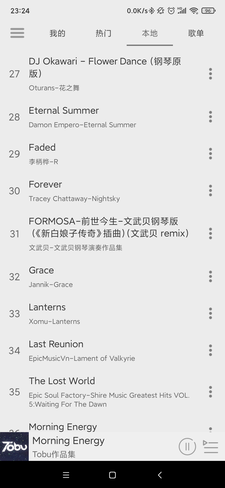
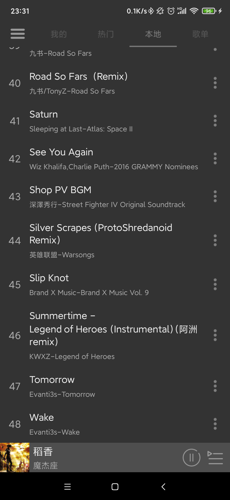
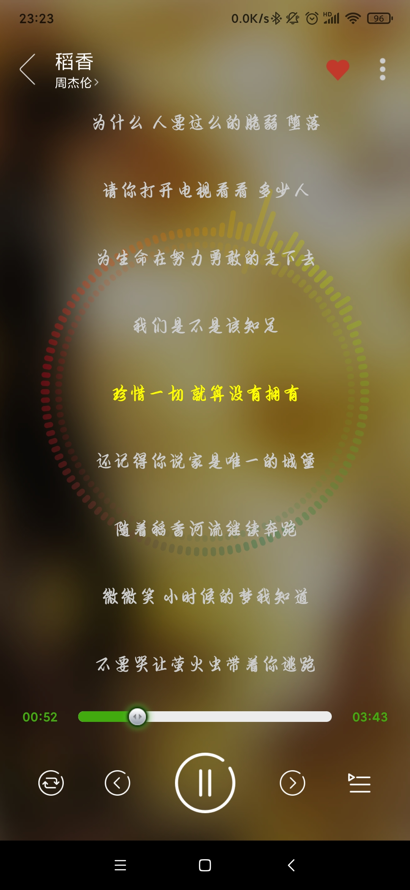
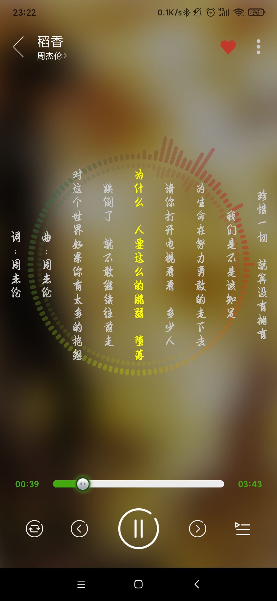
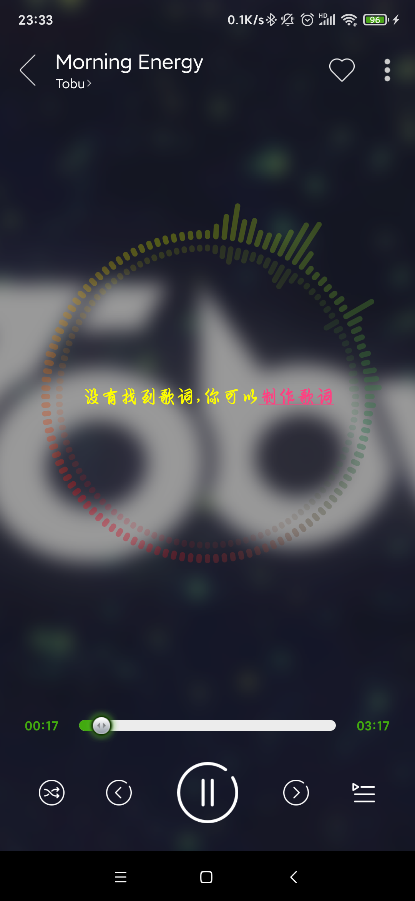

# 新动铃音乐（废弃）
备注：由于网络接口都已经无法正常使用，目前应用虽然可以正常运行，但是由于网络接口无法正常使用等因素，部分未实现的功能以及可能存在的问题将不再处理
## 包结构说明
- [common/glideComponent](app/src/main/java/com/hudson/donglingmusic/common/config/glideComponent)，该包是为了简化获取网络音乐图片地址的，主要是通过自定义Glide的component实现
- [entity](app/src/main/java/com/hudson/donglingmusic/entity)包主要是一些实体类存放包
- [module](app/src/main/java/com/hudson/donglingmusic/module)包主要存放各个模块的包
- [persistent](app/src/main/java/com/hudson/donglingmusic/persistent)主要是存在数据库以及数据缓存的包
- [service](app/src/main/java/com/hudson/donglingmusic/service)主要是后台音乐服务以及播放模式的处理等
- [UI](app/src/main/java/com/hudson/donglingmusic/UI)存放视图相关的包

## 大致UI展示
  
  

如果想要看预览视频，请[点击](resource/sample_video.mp4)
## 设计说明
整体上，整个APP由一个类似android系统Context功能的ModuleManager控制，该ModuleManager维护了一个静态的Map存储结构，用于向全局
应用范围提供各种服务（类似Context能够为APP提供的各种服务，例如Package包管理服务、WindowManager窗口管理服务等等），这样方便了
整个应用数据的统一，同时降低了部分功能被重复创建的冗余和繁琐。当然，随之带来的问题可能是，如果该服务并不是频繁使用，那么一旦创建将
在后续APP运行中一直存在。

## 各个模块简述
### 数据模块
主要是利用了Json转字符串和字符串转Json的方式，并结合GreenDao数据库，抽象一个数据缓存类，该缓存类有专门的一列用于存储json的字符串序列，
在网络数据无法获取或者网络出问题的情况下，已缓存的数据将会被启用，并反序列化成实例对象，以展示在UI页面上。这样就能保证所有数据的缓存了。

数据的获取类都存放在data包下，数据请求的参数是与数据获取类隔离的，在requestParam包下

### 换肤模块
换肤模块主要是依赖LayoutInflater.Factory2的思路来实现，在系统创建view的时候，搜集所有配置属性的view，并在合适的时机修改它们的“皮肤”属性。
注意，在android新的版本sdk中已经提供了相关夜间模式的支持，所以这种方式虽然可以，但是存在一定的适配隐患。