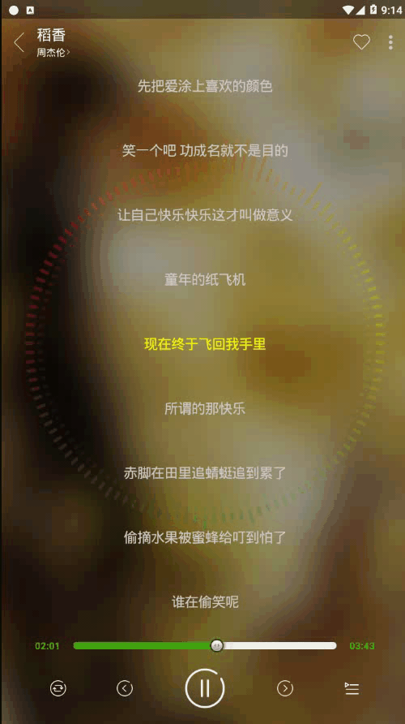
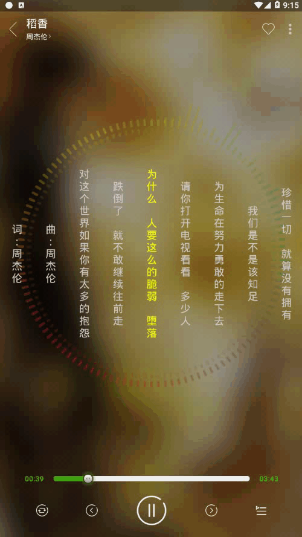

# 新动铃音乐（废弃）
备注：由于网络接口都已经无法正常使用，目前应用虽然可以正常运行，但是由于网络接口无法正常使用等因素，部分未实现的功能以及可能存在的问题将不再处理

[临时包](app/release/app-release.apk)，
注意：
- 如果需要夜间模式生效，需要把[夜间皮肤包](app/release/nightskin.skin)放入到对应应用在外部存储中创建的
donglingMusic文件夹中（注意：Android11系统不支持直接操作外部存储，此处并没有适配），点击侧边栏皮肤设置即可生效；
否则点击皮肤设置将崩溃，因为路径不正确（当前代码是写死了该路径，测试用）
- 部分功能并没有实现，已经被终止，如果遇到部分功能无法正常，请自行检查代码修改
- 应用除了未实现的功能、涉及网络接口的不能正常使用外，本地音乐播放等可以正常使用
## 包结构说明
- [common/glideComponent](app/src/main/java/com/hudson/donglingmusic/common/config/glideComponent)，该包是为了简化获取网络音乐图片地址的，主要是通过自定义Glide的component实现
- [entity](app/src/main/java/com/hudson/donglingmusic/entity)包主要是一些实体类存放包
- [module](app/src/main/java/com/hudson/donglingmusic/module)包主要存放各个模块的包
- [persistent](app/src/main/java/com/hudson/donglingmusic/persistent)主要是存在数据库以及数据缓存的包
- [service](app/src/main/java/com/hudson/donglingmusic/service)主要是后台音乐服务以及播放模式的处理等
- [UI](app/src/main/java/com/hudson/donglingmusic/UI)存放视图相关的包

## 大致UI展示

  
  

如果想要看预览视频，请[点击](resource/sample_video.mp4)
## 设计说明
整体上，整个APP由一个类似android系统Context功能的ModuleManager控制，该ModuleManager维护了一个静态的Map存储结构，用于向全局
应用范围提供各种服务（类似Context能够为APP提供的各种服务，例如Package包管理服务、WindowManager窗口管理服务等等），这样方便了
整个应用数据的统一，同时降低了部分功能被重复创建的冗余和繁琐。当然，随之带来的问题可能是，如果该服务并不是频繁使用，那么一旦创建将
在后续APP运行中一直存在。

## 各个模块简述
### 数据模块
主要是利用了Json转字符串和字符串转Json的方式，并结合GreenDao数据库，抽象一个数据缓存类，该缓存类有专门的一列用于存储json的字符串序列，
在网络数据无法获取或者网络出问题的情况下，已缓存的数据将会被启用，并反序列化成实例对象，以展示在UI页面上。这样就能保证所有数据的缓存了。

数据的获取类都存放在data包下，数据请求的参数是与数据获取类隔离的，在requestParam包下

### 换肤模块
换肤模块主要是依赖LayoutInflater.Factory2的思路来实现，在系统创建view的时候，搜集所有配置属性的view，并在合适的时机修改它们的“皮肤”属性。
本方案中需要外界提供一个带有res文件夹的空apk包（或者称为皮肤包），并在需要更换对应皮肤时，调用[SkinManager](/app/src/main/java/com/hudson/donglingmusic/module/skin/manager/SkinManager.java)的loadSkin方法,
而且要求皮肤包中定义的view属性引用的资源名相同。这里有提供一个临时[夜间皮肤包](app/release/nightskin.skin)，请按照文章最开头说明操作。
注意，在android新的版本sdk中已经提供了相关夜间模式的支持，所以这种方式虽然可以，但是存在一定的适配隐患。

### 其他模块暂未实现

## 播放模式的实现（状态模式）
所有播放模式都约束为同一个接口，并且每个接口针对用户的上一曲、下一曲有不同的逻辑处理，例如单曲循环时就返回当前歌曲的下标，而随机播放的话，则通过
随机生成器生成一个播放歌曲下标（见下面介绍）等。

而用户可以切换播放状态，为了利用链表的结构，每一个播放模式都定义它的next（下一个播放模式），由它决定创建该播放模式对象。而最初的播放模式率先
负责创建自己，并在用户选择切换模式的时候，负责创建下一个播放模式。

这样，既保证了各个模式不同的逻辑操作（状态模式），又确保了用户切换模式是按照指定顺序排列下去的，并且如果用户没有切换模式，那么其他模式对象是不会
创建的，这样避免资源的浪费。

见[代码](/app/src/main/java/com/hudson/donglingmusic/service/playState)

## 随机播放实现
随机播放需要考虑到用户已经播放过该歌曲，我们应该避免再次播放该歌曲。

很简单且高效的思路：

我们创建一个与播放列表大小相同的集合，把所有播放的index（下标）记录在随机生成类中，每次用户播放了某歌曲，我们从随机生成类中移除
该对象（注意：是移除Integer对象，不是移除下标为index的元素），这样下次产生的随机数就从剩余的集合中获取。

而随机数的获取也很容易，我们利用random方法产生一个0到当前集合大小之间的随机数，我们称之为a，这个a只是一个随机集合的下标，并不是我们
要播放歌曲的下标，我们把集合中下标是a的元素返回，并删除该位置的元素，这样下次该元素不会参与到随机数的生成中来。

这样随机数的生成实际上除了空间上使用了一个与播放列表大小相同的Integer类型集合外，仅依赖random随机方法产生随机数，并保证每次产生的随机数
不会与之前播放过的重复，时间效率取决于random的效率。当然在随机集合是空了的情况下，需要重置随机集合，这仅是往集合中添加播放歌曲列表大小的
Integer数即可，效率可以得到保障。

算法详见[代码](/app/src/main/java/com/hudson/donglingmusic/service/playState/shuffle)

## 其他
[歌词制作器](/app/src/main/java/com/hudson/donglingmusic/UI/activity/lyricsMake)、
[Tab抽象](/app/src/main/java/com/hudson/donglingmusic/UI/View/TabView)、
[引导布局](/app/src/main/java/com/hudson/donglingmusic/UI/activity/View/GuideLayout)、
VLC播放器（是VLC c++/c代码编译生成的jni的so文件，目前仅提供了armeabi-v7a CPU架构的版本）等略

[歌词播放器](https://github.com/HudsonAndroid/NewLyricsView)点击见其内部设计思路和实现方法。